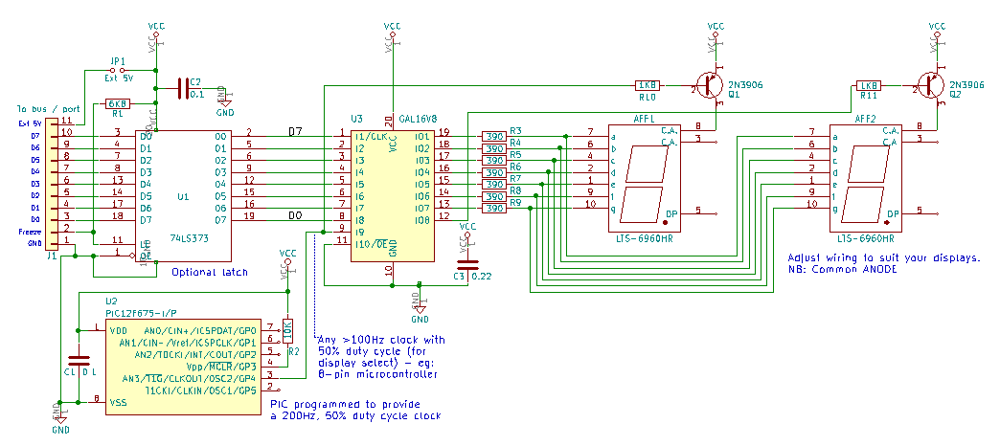
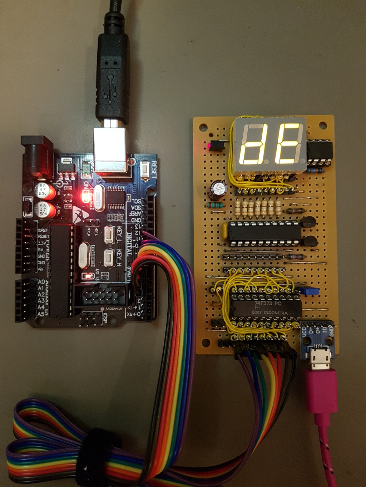

# GALBinaryTo7Seg
**8 bit binary displayed as hex on two 7 segment displays (a bus monitor)**

This circuit and CUPL code uses a GAL16V8 programmable logic device (PLD) to drive two COMMON ANODE 7 segment displays so that they display the hex representation of the 8-bit input in real time (no clocking-in or latching); this is ideal for monitoring 8-bit buses on microprocessor and microcontroller circuits. The GAL logic cells effectively act as a fast look-up table running at the nS level - unlike a microcontroller, which would respond at the uSec-mSec level. There's a full circuit schematic and further instructions below.

Although the GAL is officially a 5V part, the test circuit seemed to run OK on 3.3V. (That was without the additional, optional latch). YMMV. 

The prototype was powered from a 5V USB hub - max current consumption for the full circuit, including the optional latch, is around 110mA - around 75mA of that is for the GAL.

**Main parts**

* 1 x GAL16V8 / ATF16V8B-15PU (Microchip) from Digikey, Mouser, Farnell (Element 14), new old stock from eBay, Aliexpress, UTSource, your favourite supplier etc.). Ref: http://ww1.microchip.com/downloads/en/DeviceDoc/Atmel-0364-PLD-ATF16V8B-8BQ-8BQL-Datasheet.pdf

*GAL technology can only be reprogrammed around 100 times and although we should only need to 'burn' one once, beware of buying 'used' parts in case they are worn out.*

* 1 x 0.22uF capacitor (GAL power supply decoupling)
* 1 x 0.1uF capacitor
* 2 x 7 segment displays COMMON ANODE
* 7 x 390 ohm resistors
* 2 x 2N3906 general purpose PNP transistors
* 2 x 1K8 resistors
* A clock source (to alternate the displays by turning on the transistors one at a time) - something >= 100Hz. This could be a 555 timer or (more easily) an 8-pin microcontroller. See galclk.c (and .hex) for some C code to use an 8-pin PIC12F675 as a 100Hz clock. The .hex file is the compiled code, ready to program a PIC.

*For the optional latch (optional - see below)*
* 1 x 74LS373 or 74F373 TTL 8-bit octal transparent latch. 74HC (CMOS logic levels) or 74HCT (TTL logic levels) CMOS parts could be used, but beware that the inputs on these chips are less tolerant of static eletricity.
* 1 x 0.1uF capacitor
* 1 x 6K8 resistor

Plus: IC sockets (optional), connectors, header pins, wire, stripboard. 

The GAL needs programming - I used the low-cost TL866 'universal programmer' (IMPORTANT: Untick 'Encrypt Ch' otherwise the GAL may not program correctly). Use the .JED file here as the source for the programmer. If you want to edit/change the source PLD file, you will need a copy of WinCUPL (free from https://www.microchip.com/design-centers/programmable-logic/spld-cpld/tools/software/wincupl) or another CUPL editor.

The general wiring is as follows (you can extrapolate from the .PLD and .DOC files too - they're plain text files with more info)..

* The 8-bit binary is input on GAL pins 1-8 (5V TTL level)
* The clock that toggles the PNP transistors is input on GAL pin 9. 
* An inverse of this clock is output from GAL pin 12.
* The 7 segment outputs (in standard nomenclature for segments a-g) are output from GA pins 19 back to 13
* For correct operation, GND on this circuit needs to be connected to GND on the circuit/board where the bus is being monitored.
* The board connector includes a 5V line and jumper to allow it to be powered from the circuit/board where the bus is being monitored. ONLY use one 5V power source (hence the jumper).

**Optional extra - 74x373**

If the 8-bit input to the GAL is fed through a 74LS373/74F373 TTL 8-bit latch, that chip will free-run (no clock needed), but will freeze its output when pin 11 ('C') is taken low; this can be used as a trigger to halt the display if you need to check a value at a specific time.

**Schematic:**

**Prototype** (stripboard and wire wrap):

*Finished board, including USB power connector and 74F373 input latch, being exercised by a third-party 'Arduino'. Wirewrapping allows the chip interconnects to be made without needing a much larger board, or a mass of signal routing with enamelled copper (magnet) wire.
