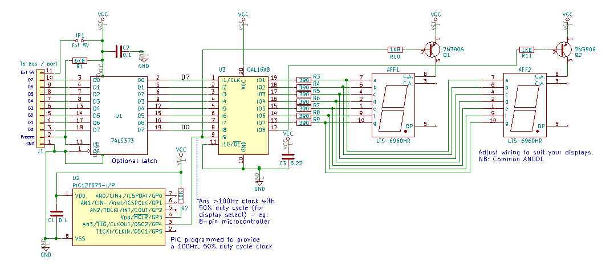

# GALBinaryTo7Seg
**8 bit binary displayed as hex on two 7 segment displays (a bus monitor)**

This CUPL code programs a GAL16V8 to drive two COMMON ANODE 7 segment displays so that they display the hex representation of the 8-bit input in real time (no clocking-in or latching). This is ideal for monitoring 8-bit buses in real time - the GAL logic cells effectively act as a fast look-up table running at the nS level - unlike a microcontroller, which would respond at the uSec-mSec level. 

There is support circuitry needed to make the whole unit; there's a schematic and further instructions below.

Although the GAL is officially a 5V part, the test circuit seemed to run OK on 3.3V. That was without a 74XX373 latch. A 74Hx/xx part may work (not tested). YMMV.

* 1 x GAL16V8 (Microchip (Atmel) or New old stock from eBay, Aliexpress or UTSource etc.)
* 1 x 0.22uF capacitor
* 2 x 7 segment displays COMMON ANODE
* 7 x 390 ohm resistors
* 2 x 2N3906 general purpose PNP transistors
* 2 x 1K8 resistors
* A clock source (to alternate the displays by turning on the transistors one at a time) - something >= 100Hz. This could be a 555 timer or (more easily) an 8-pin microcontroller. See galclk.c (and .hex) for some C code to use an 8-pin PIC12F675 as a 100Hz clock. The .hex file is the compiled code, ready to program a PIC.
* 1 x 74LS373 8-bit buffer (optional - see below)

You will also need a GAL programmer (the TL866 can do it - that's what I use. IMPORTANT: Untick 'Encrypt Ch' otherwise the GAL may not program correctly.). Use the .JED file here as the source for the programmer. If you want to edit/change the source PLD file, you will need a copy of WinCUPL (free from https://www.microchip.com/design-centers/programmable-logic/spld-cpld/tools/software/wincupl) or another CUPL editor.

The general wiring is as follows (you can extrapolate from the .PLD and .DOC files too - they're plain text files with more info)..

* The 8-bit binary is input on GAL pins 1-8 (5V TTL level)
* The clock that toggles the PNP transistors is input on pin 9. 
* An inverse of this clock is output from pin 12.
* The 7 segment outputs (in standard nomenclature for segments a-g) are output from pins 19 back to 13
* For correct operation, GND on this circuit needs to be connected to GND on the circuit/board where the bus is being monitored.
* The board connector includes a 5V line and jumper to allow it to be powered from the circuit/board where the bus is being monitored. ONLY use one 5V power source (hence the jumper).

**Optional extra - 74LS373**

If you feed the 8-bit input to the GAL through a 74LS373 8-bit latch, this chip will free-run (no clock needed), but will freeze its output when pin 11 ('C') is taken low - so you can use this as a trigger to halt the display if you need to check a value at a specific time.

**Schematic:**

**Prototype** (stripboard and wire wrap):

*Finished board, including USB power connector and 74F373 input latch*
